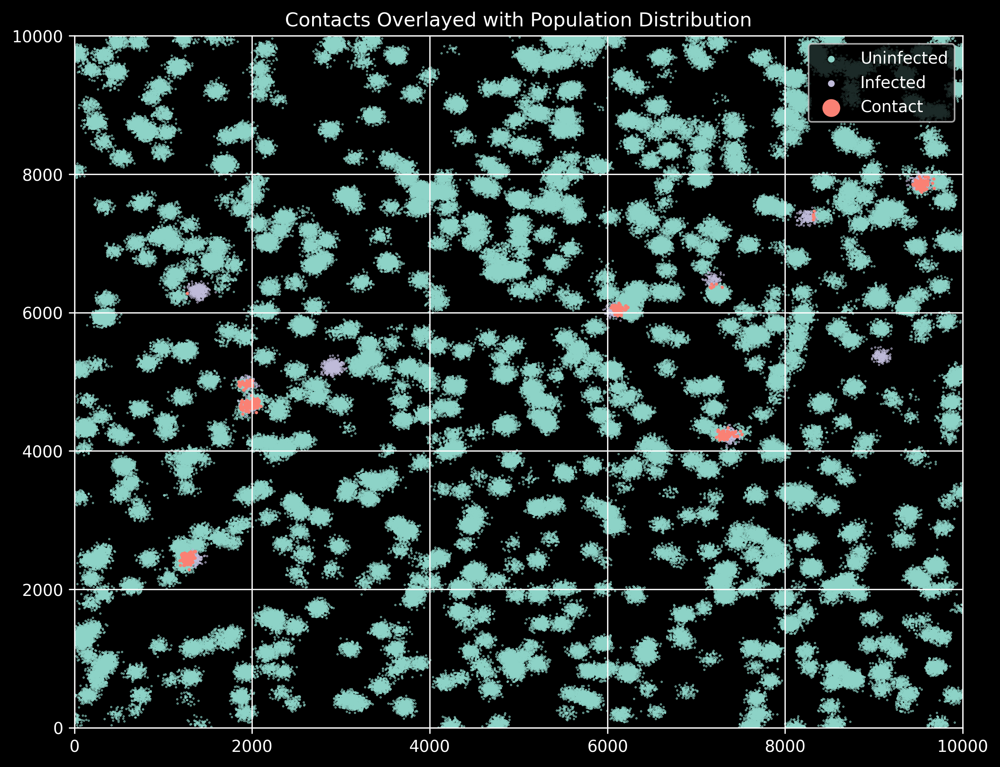

# ELECTRA
Contact Tracing Algorithm using Location Based Encryption (Encrypted Location Enabled Contact TRacing Algorithm)

# Location Based Encryption Contact Tracing Algorithm

The contact tracing algorithm uses gps location data to encrypt a unique id. This encrypted data can then be published publicaly where other users try to decrypt the data with their own gps location data. The decryption attempts are then given to a centralized service which looks for matches between the data and the unique ids given to users that are confirmed as infected.

The algorithm is a proof of concept to work out the statistics and processing chain.

## Potential Issues

The decryption attempts generate a large data set of mostly erroneous data which needs to be checked against the unique id database, this takes a significant amount of operations that could bog down servers. The other issue is in the generation of the decryption attempts that could tax user devices to process if there are a large number of infected users. 

The method of encrypting data with location based key is that there might not be enough entropy in the key to have a strong encryption, this is hopefully mitigated by the centralized service confirming contacts.

# Basic Population Simulation for Contact Tracing

In order to test a contact tracing algorithm we first need a simulation environment for human like movement. Now this is not an accurate simulation of contagion movement throught a population but tries to estimate the amount of data a contact tracing solution would need to process.

## Setup

Configure the generics for the size of the test area, the poulation density in people per square km, the simulation length in days, the cell area that difines the contact area, and the percent of infected. (make sure that the x and y area is an integer multiple of the x and y cell)

The other values that need to be configured are the random variable distributions, first for the number of places an individual in the population moves per day, and the variance in the distance from that spot.

## Outputs

The simulation outputs several graphs showing the distribution of population as well as the population overlayed with infected and contacts. The simulation also outputs some general statistics and saves the people array and infected people array as a pickle files that can be ingested into a contact tracing algorithm.
